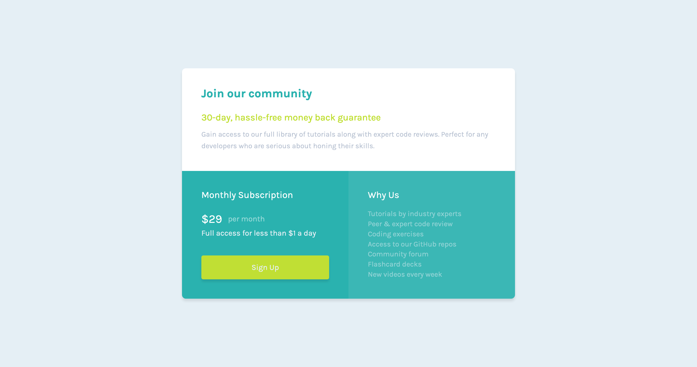

# Frontend Mentor - Single price grid component solution

This is a solution to the [Single price grid component challenge on Frontend Mentor](https://www.frontendmentor.io/challenges/single-price-grid-component-5ce41129d0ff452fec5abbbc). Frontend Mentor challenges help you improve your coding skills by building realistic projects. 

## Table of contents

- [Overview](#overview)
  - [The challenge](#the-challenge)
  - [Screenshot](#screenshot)
  - [Links](#links)
- [My process](#my-process)
  - [Built with](#built-with)
  - [What I learned](#what-i-learned)
- [Author](#author)

**Note: Delete this note and update the table of contents based on what sections you keep.**

## Overview

### The challenge

Users should be able to:

- View the optimal layout for the component depending on their device's screen size
- See a hover state on desktop for the Sign Up call-to-action

### Screenshot



### Links

- [Solution](https://github.com/ryanthayes/fem-single-price-grid-component)
- [Live URL](https://ryanthayes.github.io/fem-single-price-grid-component)

## My process

### Built with

- Semantic HTML5 markup
- CSS custom properties
- Flexbox
- CSS Grid
- Mobile-first workflow

### What I learned

For this project I started to experiment with modifier classes. I am trying to practice using "best practices" that will scale to larger projects.

```html
<div class="subscription__cta padding-1">
<div class="subscription__cost flex align-center">
```
```css
.align-center {
    align-items: center;
}
.padding-1 {
    padding: 1.8em;
}
.mt-1 {
    margin-top: 2em;
}
```

## Author

- Github - (https://github.com/ryanthayes)
- Frontend Mentor - (https://www.frontendmentor.io/profile/ryanthayes)
